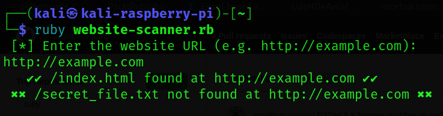

<h1><b>Website Subdomain Scanner</b></h1>
<h2><i>This Is A Software To Scan If The Subdomain Of Any Website.</h1></i>

#
 </a>

#
<h2><b> 😇 Author: Sumalya Chatterjee </b></h2>

#
<h1><b>❤️ Don't Copy, Do Fork 😊</b></h1>

#

<h1><b>Result 👇</b></h1>



#

<h1><b>Git Installation </h1></b>

```
# Install Git
sudo apt install git

# Install Ruby
sudo apt install ruby

# Git Clone
git clone https://github.com/R3DHULK/website-scanner-in-ruby

# Change Directory
cd website-scanner-in-ruby

# To Run The Tool
ruby website-scanner.rb

```

#
<h2><b><i> Show Support 👇👇👇</b></i> </h2>
<a href="https://www.buymeacoffee.com/r3dhulk"> </a><br><br>
